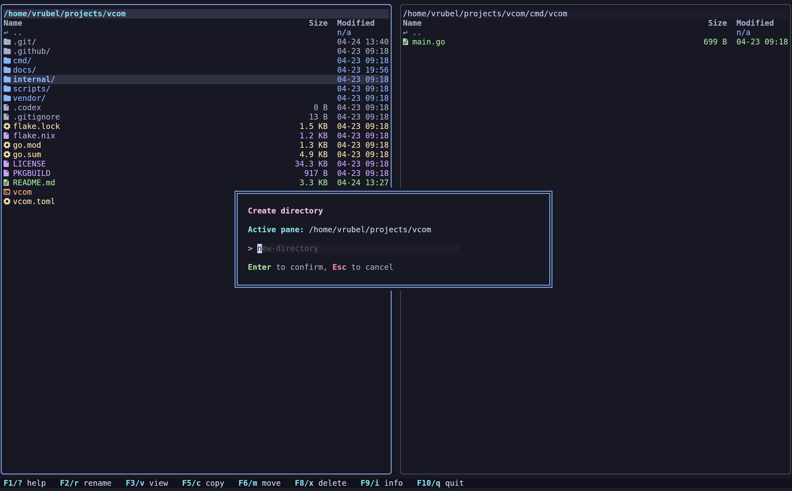
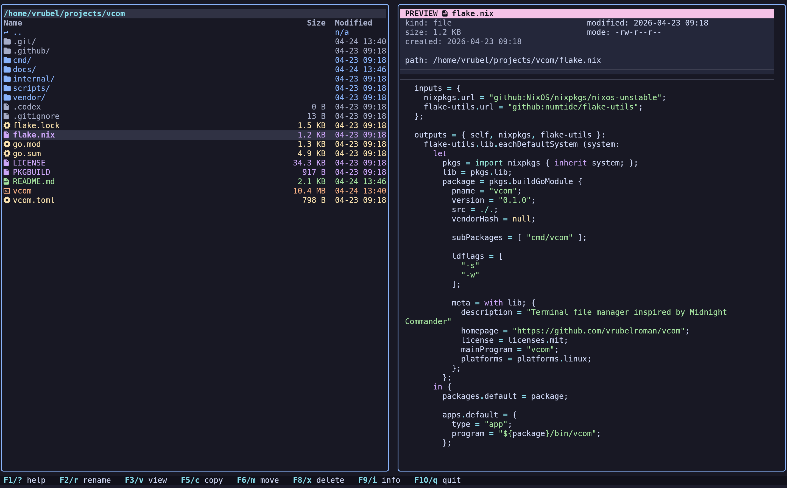
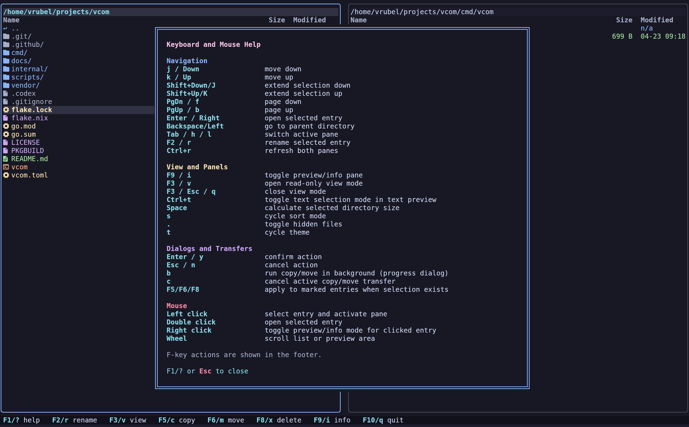

# vcom

`vcom` is a two-pane terminal file manager with a fast built-in info/preview panel for the active selection.

## Why vcom

- Two-pane workflow focused on keyboard speed
- Built-in preview/info pane for the active selection
- Asynchronous copy/move with progress and background mode
- Theme support and configurable layout/columns

## Font requirement (icons)

For file icons, `vcom` expects a Nerd Font in your terminal profile.

Default behavior is `ui.icon_mode = "auto"`:

- if a Nerd Font is detected, `vcom` uses Nerd icons
- if not, `vcom` falls back to ASCII icons automatically

You can force behavior in config:

- `ui.icon_mode = "nerd"`: always use Nerd icons
- `ui.icon_mode = "ascii"`: always use ASCII icons

How to make terminal use the installed Nerd Font:

- GNOME Terminal: `Preferences -> Profile -> Text -> Custom font` -> choose `JetBrainsMono Nerd Font`
- Konsole: `Settings -> Edit Current Profile -> Appearance` -> choose a Nerd Font profile
- Alacritty: set `font.normal.family: "JetBrainsMono Nerd Font"` in `~/.config/alacritty/alacritty.yml`
- Kitty: set `font_family JetBrainsMono Nerd Font` in `~/.config/kitty/kitty.conf`

Preview mode (`F9` / `i`) temporarily replaces the inactive pane and shows:

- directory listing preview
- text file preview with syntax highlighting
- image metadata (format + dimensions)
- safe fallback for binary files

## Screenshots





## Build and run

Run directly:

```bash
go run ./cmd/vcom
```

Build local binary:

```bash
go build -o vcom ./cmd/vcom
```

## Installation

### NixOS / Nix

Run directly from the flake:

```bash
nix run github:vrubelroman/vcom?ref=v0.1.3
```

Install into user profile:

```bash
nix profile add github:vrubelroman/vcom?ref=v0.1.3
```

### Debian / Ubuntu

Download the release `.deb` for `v0.1.3`, then install:

```bash
sudo apt install ./vcom_0.1.3_amd64.deb
```

Install a Nerd Font (example):

```bash
wget -qO /tmp/JetBrainsMono.zip https://github.com/ryanoasis/nerd-fonts/releases/latest/download/JetBrainsMono.zip
mkdir -p ~/.local/share/fonts/JetBrainsMonoNerd
unzip -o /tmp/JetBrainsMono.zip -d ~/.local/share/fonts/JetBrainsMonoNerd
fc-cache -fv
```

Then set your terminal font to a Nerd Font variant (for example, `JetBrainsMono Nerd Font`).

### Arch Linux

A `PKGBUILD` is included in the repository:

```bash
makepkg -si
```

## Configuration

Optional config lookup order:

1. `-config /path/to/vcom.toml`
2. `./vcom.toml`
3. `./config/vcom.toml`
4. `$XDG_CONFIG_HOME/vcom/vcom.toml`
5. `~/.config/vcom/vcom.toml`

Reference config: [vcom.toml](/home/vrubel/projects/vcom/vcom.toml)

Icon mode example:

```toml
[ui]
icon_mode = "auto" # auto | nerd | ascii
```

## Themes

Built-in themes:

- `catppuccin-mocha` (default)
- `tokyo-night`
- `gruvbox-dark`
- `nord-frost`

## Releases

Pushing a tag like `v0.1.3` triggers GitHub Actions release workflow (`.github/workflows/release.yml`) which:

- runs tests
- vendors Go modules
- builds release binary
- builds Debian package
- publishes release assets

Release artifacts:

- `vcom-v0.1.3-x86_64-unknown-linux-gnu.tar.gz`
- `vcom_0.1.3_amd64.deb`
- `vcom-v0.1.3-checksums.txt`

## Notes

- File creation time depends on filesystem/OS support; unavailable values are shown as `n/a`.
- Image preview in info pane (`F9`) and image full-screen view (`F3`) use `chafa`.

Architecture notes: [docs/architecture.md](/home/vrubel/projects/vcom/docs/architecture.md)
