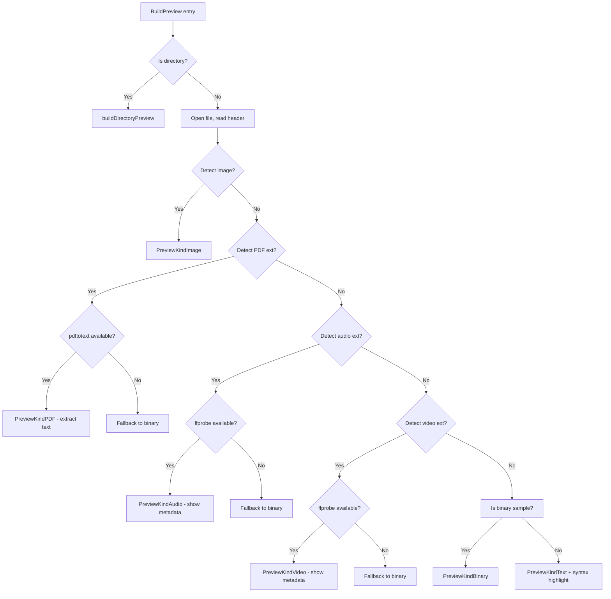

# Extended Preview — PDF, Audio, Video via External Utilities

## Overview

Add rich preview support for three new file categories by leveraging external CLI tools. If a tool is not installed, the file falls back to the existing binary-file display.



## 1. New PreviewKind Constants

File: [`internal/fs/preview.go`](internal/fs/preview.go) (around line 28-35)

Add three new constants to the `PreviewKind` type:
- `PreviewKindPDF     PreviewKind = "pdf"`
- `PreviewKindAudio   PreviewKind = "audio"`
- `PreviewKindVideo   PreviewKind = "video"`

## 2. Extended Metadata Struct

File: [`internal/fs/preview.go`](internal/fs/preview.go) — `Metadata` struct (line 37-48)

Add new optional fields:

```go
type Metadata struct {
    // ... existing fields ...

    // Extended preview metadata
    Duration    string  // audio/video duration (e.g. "3:42")
    Bitrate     string  // audio/video bitrate (e.g. "320 kbps")
    AudioCodec  string  // audio codec (e.g. "aac", "mp3")
    VideoCodec  string  // video codec (e.g. "h264", "vp9")
    SampleRate  string  // audio sample rate (e.g. "44100 Hz")
    Channels    string  // audio channels (e.g. "stereo")
    PageCount   string  // PDF page count
    Dimensions  string  // video dimensions (e.g. "1920x1080")
}
```

## 3. New Extension Maps

File: [`internal/fs/entry.go`](internal/fs/entry.go) (around line 55-63)

Add three new extension sets:

```go
pdfExtensions = map[string]struct{}{
    "pdf": {},
}
audioExtensions = map[string]struct{}{
    "mp3": {}, "flac": {}, "ogg": {}, "opus": {}, "wav": {},
    "aac": {}, "m4a": {}, "wma": {}, "dsf": {}, "ape": {},
}
videoExtensions = map[string]struct{}{
    "mp4": {}, "mkv": {}, "mov": {}, "avi": {}, "webm": {},
    "m4v": {}, "wmv": {}, "flv": {}, "ts": {}, "mts": {},
}
```

## 4. New Categories in `Category()` Method

File: [`internal/fs/entry.go`](internal/fs/entry.go) — `Category()` method (line 102-123)

Add three new cases in the switch statement (before `default`):

```go
case hasExt(pdfExtensions, e.Extension):
    return "pdf"
case hasExt(audioExtensions, e.Extension):
    return "audio"
case hasExt(videoExtensions, e.Extension):
    return "video"
```

## 5. External Utility Detection

File: [`internal/fs/preview.go`](internal/fs/preview.go) — new helper functions

```go
func findTool(name string) string {
    path, err := exec.LookPath(name)
    if err != nil {
        return ""
    }
    return path
}
```

Add `"os/exec"` to imports.

## 6. Modified `BuildPreview()` Flow

File: [`internal/fs/preview.go`](internal/fs/preview.go) — `BuildPreview()` (line 73)

Insert the new checks after the image detection block (after line 131) and before the `IsBinarySample()` check:

```go
// PDF preview via pdftotext
if hasExt(pdfExtensions, entry.Extension) {
    return buildPDFPreview(entry, options, preview)
}

// Audio preview via ffprobe
if hasExt(audioExtensions, entry.Extension) {
    return buildAudioPreview(entry, options, preview)
}

// Video preview via ffprobe
if hasExt(videoExtensions, entry.Extension) {
    return buildVideoPreview(entry, options, preview)
}
```

This placement ensures:
- Images are still detected by magic bytes (works for any extension)
- PDF/audio/video get their custom handling
- Files that don't match any category fall through to the existing binary/text detection

## 7. New Preview Builder Functions

File: [`internal/fs/preview.go`](internal/fs/preview.go) — new functions

### 7a. `buildPDFPreview()`

```go
func buildPDFPreview(entry Entry, options PreviewOptions, base Preview) Preview {
    pdftotext := findTool("pdftotext")
    if pdftotext == "" {
        base.Kind = PreviewKindBinary
        base.Body = "PDF file detected.\nInstall poppler-utils (pdftotext) for text preview."
        base.PlainBody = base.Body
        return base
    }

    // Extract text
    cmd := exec.Command(pdftotext, "-layout", "-nopgbrk", entry.Path, "-")
    out, err := cmd.Output()
    if err != nil {
        base.Kind = PreviewKindError
        base.Body = fmt.Sprintf("pdftotext error:\n\n%s", err)
        base.PlainBody = base.Body
        return base
    }

    text := string(out)
    if len(text) > int(options.MaxPreviewBytes) {
        text = text[:options.MaxPreviewBytes]
    }

    // Get page count via pdfinfo if available
    pdfinfo := findTool("pdfinfo")
    if pdfinfo != "" {
        infoCmd := exec.Command(pdfinfo, entry.Path)
        if infoOut, err := infoCmd.Output(); err == nil {
            for _, line := range strings.Split(string(infoOut), "\n") {
                if strings.HasPrefix(strings.ToLower(line), "pages:") {
                    base.Metadata.PageCount = strings.TrimSpace(strings.TrimPrefix(line, "Pages:"))
                    break
                }
            }
        }
    }

    base.Kind = PreviewKindPDF
    base.PlainBody = text
    base.Body = highlightText(entry.Path, text, options.ThemeName)
    return base
}
```

### 7b. `buildAudioPreview()`

```go
func buildAudioPreview(entry Entry, options PreviewOptions, base Preview) Preview {
    ffprobe := findTool("ffprobe")
    if ffprobe == "" {
        base.Kind = PreviewKindBinary
        base.Body = "Audio file detected.\nInstall ffmpeg (ffprobe) for metadata preview."
        base.PlainBody = base.Body
        return base
    }

    // Use ffprobe to extract metadata as JSON
    cmd := exec.Command(ffprobe,
        "-v", "quiet",
        "-print_format", "json",
        "-show_format",
        "-show_streams",
        entry.Path,
    )
    out, err := cmd.Output()
    if err != nil {
        base.Kind = PreviewKindError
        base.Body = fmt.Sprintf("ffprobe error:\n\n%s", err)
        base.PlainBody = base.Body
        return base
    }

    var info struct {
        Format struct {
            Duration string `json:"duration"`
            Bitrate  string `json:"bit_rate"`
        } `json:"format"`
        Streams []struct {
            CodecType string `json:"codec_type"`
            CodecName string `json:"codec_name"`
            SampleRate string `json:"sample_rate"`
            Channels    int    `json:"channels"`
        } `json:"streams"`
    }
    if err := json.Unmarshal(out, &info); err != nil {
        base.Kind = PreviewKindError
        base.Body = fmt.Sprintf("Could not parse ffprobe output:\n\n%s", err)
        base.PlainBody = base.Body
        return base
    }

    // Format duration
    if info.Format.Duration != "" {
        if secs, err := strconv.ParseFloat(info.Format.Duration, 64); err == nil {
            mins := int(secs) / 60
            secsRem := int(secs) % 60
            base.Metadata.Duration = fmt.Sprintf("%d:%02d", mins, secsRem)
        }
    }

    if info.Format.Bitrate != "" {
        if bps, err := strconv.ParseInt(info.Format.Bitrate, 10, 64); err == nil {
            base.Metadata.Bitrate = fmt.Sprintf("%d kbps", bps/1000)
        }
    }

    for _, stream := range info.Streams {
        if stream.CodecType == "audio" {
            base.Metadata.AudioCodec = stream.CodecName
            if stream.SampleRate != "" {
                base.Metadata.SampleRate = stream.SampleRate + " Hz"
            }
            switch stream.Channels {
            case 1:
                base.Metadata.Channels = "mono"
            case 2:
                base.Metadata.Channels = "stereo"
            case 6:
                base.Metadata.Channels = "5.1"
            case 8:
                base.Metadata.Channels = "7.1"
            default:
                base.Metadata.Channels = fmt.Sprintf("%d ch", stream.Channels)
            }
            break
        }
    }

    // Build a rich metadata body
    var lines []string
    lines = append(lines, fmt.Sprintf("  Duration: %s", base.Metadata.Duration))
    if base.Metadata.Bitrate != "" {
        lines = append(lines, fmt.Sprintf("  Bitrate:  %s", base.Metadata.Bitrate))
    }
    if base.Metadata.AudioCodec != "" {
        lines = append(lines, fmt.Sprintf("  Codec:    %s", base.Metadata.AudioCodec))
    }
    if base.Metadata.SampleRate != "" {
        lines = append(lines, fmt.Sprintf("  Rate:     %s", base.Metadata.SampleRate))
    }
    if base.Metadata.Channels != "" {
        lines = append(lines, fmt.Sprintf("  Channels: %s", base.Metadata.Channels))
    }

    base.Kind = PreviewKindAudio
    base.Body = fmt.Sprintf("🎵 Audio File\n\n%s", strings.Join(lines, "\n"))
    base.PlainBody = fmt.Sprintf("Audio File\n\nDuration: %s\nBitrate: %s\nCodec: %s\nRate: %s\nChannels: %s",
        base.Metadata.Duration, base.Metadata.Bitrate, base.Metadata.AudioCodec,
        base.Metadata.SampleRate, base.Metadata.Channels)
    return base
}
```

### 7c. `buildVideoPreview()`

```go
func buildVideoPreview(entry Entry, options PreviewOptions, base Preview) Preview {
    ffprobe := findTool("ffprobe")
    if ffprobe == "" {
        base.Kind = PreviewKindBinary
        base.Body = "Video file detected.\nInstall ffmpeg (ffprobe) for metadata preview."
        base.PlainBody = base.Body
        return base
    }

    // Use ffprobe to extract metadata as JSON
    cmd := exec.Command(ffprobe,
        "-v", "quiet",
        "-print_format", "json",
        "-show_format",
        "-show_streams",
        entry.Path,
    )
    out, err := cmd.Output()
    if err != nil {
        base.Kind = PreviewKindError
        base.Body = fmt.Sprintf("ffprobe error:\n\n%s", err)
        base.PlainBody = base.Body
        return base
    }

    var info struct {
        Format struct {
            Duration string `json:"duration"`
            Bitrate  string `json:"bit_rate"`
        } `json:"format"`
        Streams []struct {
            CodecType string `json:"codec_type"`
            CodecName string `json:"codec_name"`
            Width     int    `json:"width"`
            Height    int    `json:"height"`
        } `json:"streams"`
    }
    if err := json.Unmarshal(out, &info); err != nil {
        base.Kind = PreviewKindError
        base.Body = fmt.Sprintf("Could not parse ffprobe output:\n\n%s", err)
        base.PlainBody = base.Body
        return base
    }

    // Format duration
    if info.Format.Duration != "" {
        if secs, err := strconv.ParseFloat(info.Format.Duration, 64); err == nil {
            hrs := int(secs) / 3600
            mins := (int(secs) % 3600) / 60
            secsRem := int(secs) % 60
            if hrs > 0 {
                base.Metadata.Duration = fmt.Sprintf("%d:%02d:%02d", hrs, mins, secsRem)
            } else {
                base.Metadata.Duration = fmt.Sprintf("%d:%02d", mins, secsRem)
            }
        }
    }

    if info.Format.Bitrate != "" {
        if bps, err := strconv.ParseInt(info.Format.Bitrate, 10, 64); err == nil {
            base.Metadata.Bitrate = fmt.Sprintf("%d kbps", bps/1000)
        }
    }

    for _, stream := range info.Streams {
        switch stream.CodecType {
        case "video":
            base.Metadata.VideoCodec = stream.CodecName
            if stream.Width > 0 && stream.Height > 0 {
                base.Metadata.Dimensions = fmt.Sprintf("%dx%d", stream.Width, stream.Height)
            }
        case "audio":
            if base.Metadata.AudioCodec == "" {
                base.Metadata.AudioCodec = stream.CodecName
            }
        }
    }

    // Build a rich metadata body
    var lines []string
    lines = append(lines, fmt.Sprintf("  Duration:   %s", base.Metadata.Duration))
    if base.Metadata.Bitrate != "" {
        lines = append(lines, fmt.Sprintf("  Bitrate:    %s", base.Metadata.Bitrate))
    }
    if base.Metadata.VideoCodec != "" {
        lines = append(lines, fmt.Sprintf("  Video:      %s", base.Metadata.VideoCodec))
    }
    if base.Metadata.Dimensions != "" {
        lines = append(lines, fmt.Sprintf("  Resolution: %s", base.Metadata.Dimensions))
    }
    if base.Metadata.AudioCodec != "" {
        lines = append(lines, fmt.Sprintf("  Audio:      %s", base.Metadata.AudioCodec))
    }

    base.Kind = PreviewKindVideo
    base.Body = fmt.Sprintf("🎬 Video File\n\n%s", strings.Join(lines, "\n"))
    base.PlainBody = fmt.Sprintf("Video File\n\nDuration: %s\nBitrate: %s\nVideo: %s\nResolution: %s\nAudio: %s",
        base.Metadata.Duration, base.Metadata.Bitrate, base.Metadata.VideoCodec,
        base.Metadata.Dimensions, base.Metadata.AudioCodec)
    return base
}
```

## 8. UI: Update `renderMetadata()`

File: [`internal/ui/model.go`](internal/ui/model.go) — `renderMetadata()` (line 2714)

Add new metadata fields to the right column after the image info block:

```go
// After: if meta.ImageFormat != "" { ... }

if meta.Duration != "" {
    rightRows = append(rightRows, fmt.Sprintf("duration: %s", meta.Duration))
}
if meta.Bitrate != "" {
    rightRows = append(rightRows, fmt.Sprintf("bitrate: %s", meta.Bitrate))
}
if meta.AudioCodec != "" {
    rightRows = append(rightRows, fmt.Sprintf("audio: %s", meta.AudioCodec))
}
if meta.VideoCodec != "" {
    rightRows = append(rightRows, fmt.Sprintf("video: %s", meta.VideoCodec))
}
if meta.Dimensions != "" {
    rightRows = append(rightRows, fmt.Sprintf("resolution: %s", meta.Dimensions))
}
if meta.SampleRate != "" {
    rightRows = append(rightRows, fmt.Sprintf("rate: %s", meta.SampleRate))
}
if meta.Channels != "" {
    rightRows = append(rightRows, fmt.Sprintf("channels: %s", meta.Channels))
}
if meta.PageCount != "" {
    rightRows = append(rightRows, fmt.Sprintf("pages: %s", meta.PageCount))
}
```

## 9. UI: Update `previewIcon()`

File: [`internal/ui/model.go`](internal/ui/model.go) — `previewIcon()` (line 3545)

Add new Nerd Font icons:

```go
case vfs.PreviewKindPDF:
    return "󰷉"   // nf-oct-file-pdf
case vfs.PreviewKindAudio:
    return "󰋋"   // nf-custom-audio-file
case vfs.PreviewKindVideo:
    return "󰋲"   // nf-custom-video-file
```

And ASCII fallback:
```go
case "pdf":
    return "[P]"
case "audio":
    return "[A]"
case "video":
    return "[V]"
```

## 10. UI: Update `syncImageOverlay()`

File: [`internal/ui/model.go`](internal/ui/model.go) — `syncImageOverlay()` (line 4225)

The overlay should only show for `PreviewKindImage`, which it already checks. No change needed — video files should NOT use the image overlay since we don't have video thumbnail support yet.

## 11. Files Changed Summary

| File | Changes |
|------|---------|
| [`internal/fs/entry.go`](internal/fs/entry.go) | Add `pdfExtensions`, `audioExtensions`, `videoExtensions` maps; update `Category()` method |
| [`internal/fs/preview.go`](internal/fs/preview.go) | Add `PreviewKindPDF/Audio/Video` constants; add fields to `Metadata`; add `findTool()`, `buildPDFPreview()`, `buildAudioPreview()`, `buildVideoPreview()`; modify `BuildPreview()` insertion point; add `"os/exec"`, `"encoding/json"` imports |
| [`internal/ui/model.go`](internal/ui/model.go) | Update `renderMetadata()` with new fields; update `previewIcon()` with new icons |

## 12. Edge Cases & Considerations

- **Missing external tool**: If `pdftotext` or `ffprobe` is not installed, the user sees a helpful message telling them which package to install, and the preview falls back to `PreviewKindBinary` (same as before).
- **Large PDFs**: Text extraction respects `MaxPreviewBytes` limit — truncated output is still highlighted.
- **Corrupt files**: `ffprobe` and `pdftotext` handle errors gracefully; any non-zero exit returns `PreviewKindError` with the error message.
- **Performance**: External processes are launched synchronously in the preview command (which already runs in a goroutine via `loadPreviewCmd()`), so the UI remains responsive.
- **No new dependencies**: All tools are invoked via `os/exec` (stdlib). No Go modules needed.

## 13. Test Plan

1. Open `test.pdf` — verify text is extracted and syntax-highlighted, page count shown in metadata
2. Open `test.mp3` — verify duration, bitrate, codec, sample rate, channels shown
3. Open `test.flac` — same as above
4. Open `test.mp4` — verify duration, bitrate, video codec, resolution, audio codec shown
5. Open PDF/audio/video on a system without `pdftotext`/`ffprobe` — verify fallback message
6. Verify `go build ./...` and `go vet ./...` pass
